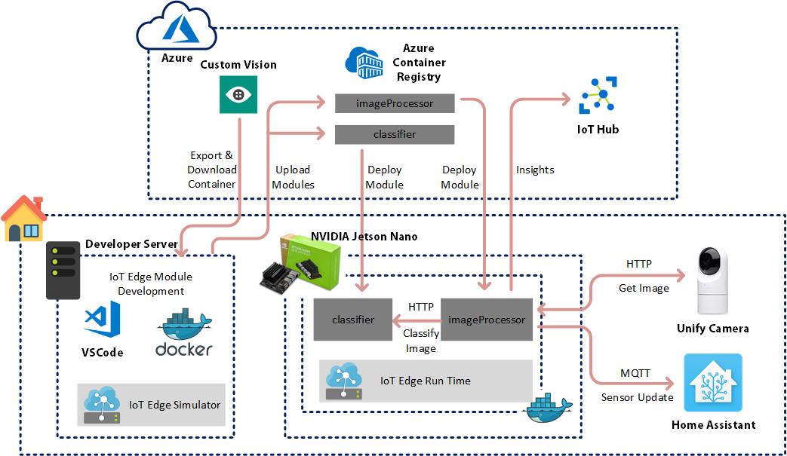
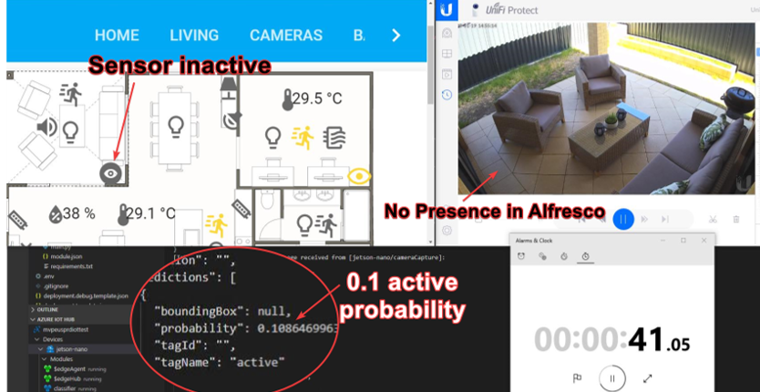
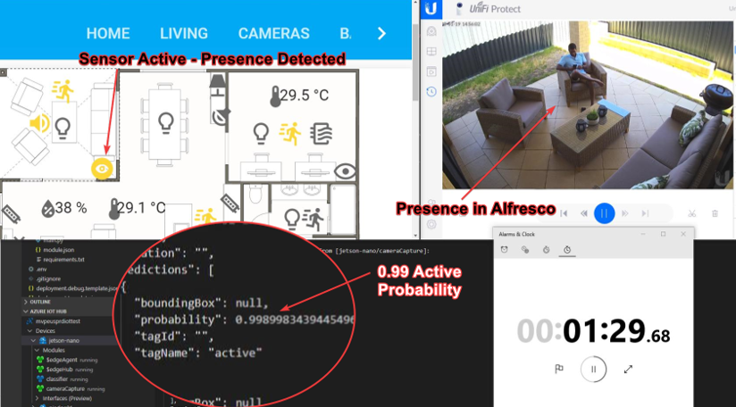
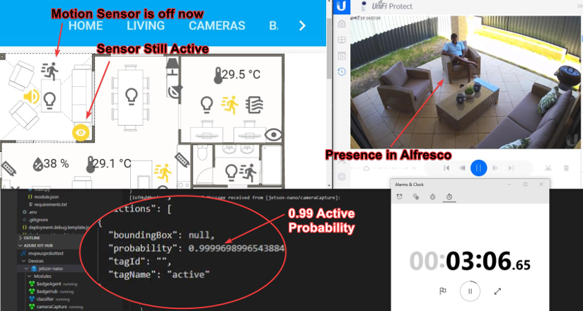
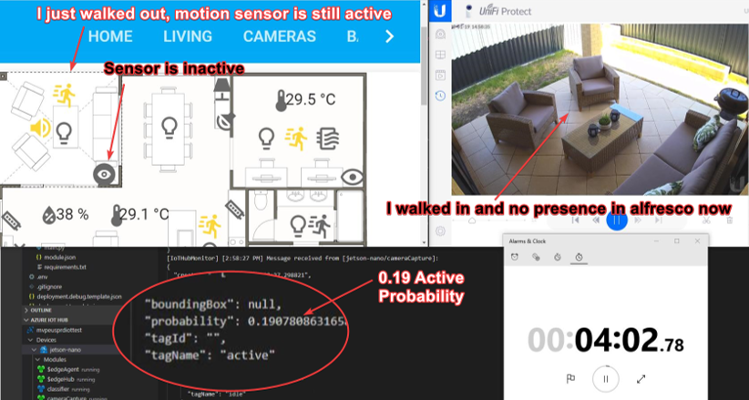

# Alfresco Image Processing with Azure IoT Edge

This project includes the source code I used to image process my alfresco camera feed to support my home automation project. I used Azure IoT Edge to run image processing at the edge to detect if there is any presence in my alfresco. The reason I wanted to do this is, motion sensors goes idle when someone is sitting at the alfresco. I have rules configured in my home automation to play music in the alfresco when there is motion. When there is no motion it will stop playing music. It’s quite common for someone to sit down, chill in the alfresco and this logic doesn’t work well when people are sitting without any motion in the alfresco. I want the music to continue playing when there is some presence, even without motion. Image processing helps me to achieve this.

I used image processing with object detection modules in Home assistant. It worked “OK”, however, the accuracy of module wasn’t that great. Therefore, I recently played with the Azure IoT Edge with a custom trained vision module. The beauty of this is, you train the module saying the state of the image. Once you train the module enough, Azure Machine Learning is playing an amazing role predicting the future presented images. I put this method in to test and realised that the accuracy went over the roof. So, I thought of sharing the story so that if you can try it your self as well.

Note that, you will need the following if you want to try this out on your own.

- Azure Subscription
- Home Assistant Setup
- A camera for Image feed.
- Raspberry Pi 4 or Similar

I’m planning to write detail blog post for each item configuration. This post will be covering a high-level architecture overview and the results.

Following is the architecture I went through.

 

I had developer machine which is running on a server at my home. This is where I did my development. Because it needed a bunch of development tools, I decided not to use my laptop for the development.

First, I created the custom vision module using https://www.customvision.ai/. I collected a lot of images from my recordings and uploaded them. Then I tagged them accordingly.

I downloaded the classification module. In the model, I selected a general single tag module. This way the decision making is much easier for the module and the accuracy is much higher.

I used this module and I developed my IoT edge Modules. IoT edge modules talk to the video camera to get an image, then feed that into the classifier module, get the results, evaluate it and update the home assistant sensor accordingly. All module communication and the camera communication happen over HTTP. The sensor updates to the Home Assistant occur over the MQTT.

Following are some test results shared with you. On the left top, I have the Home Assistant Sensors indicated in my floor plan. The icon looking like an “eye” is the image processing sensor. If it detects presence, it will turn yellow and if it’s undetected it will stay grey. On the right top it’s the camera video live feed of the alfresco. As you can see, there is no presence right now and the sensor is grey. There’s no motion detected in the alfresco and hence, there’s no music.

 

At the bottom left, you can see results output from the classifier. You can see there’s only a 0.1 probability on “Active” tag. Active Tag is same as Presence detection in Alfresco. I just gave it active at the time of training my module. At the bottom right is a timer for you to understand the timing.

In the following image, I started walking in to the alfresco, sat down and chilled. On the top right camera view, you can see me sitting. On the left top, you can see that the motion sensor is active as I just walked in. You can also see that the IoT edge image processing module has already detected presence in the alfresco. You can see that the probability has gone to 0.99 and hence the sensor is triggered active.

After another 1.5 minutes, you can see in the following picture that the motion sensor in the alfresco has gone inactive. This is because I’m sitting, chilling and there is no motion. Ideally, this would have turned the living music. Now because I have image processing sensor, I have a condition for that automation to, not to execute it when the image processing sensor is active. Therefore, the whole system is working as I expected.

Now I have achieved what I want, I walked out of the alfresco. As you can see in the below image, Image processing IoT edge module has already detected that I’m not there. The motion sensor is still active as I have just walked out. It will time out the motion soon and the music will stop this time as the image processing sensor is inactive. You can see at the bottom left that the probability is gone down back again to 0.19.

I had probability 0.60 as the cut-off mark to detect presence.

As you can see above, it’s an interesting small project. This blog post explains the full project in a post. I’ll explain how each component was done in detail in future posts. IoT edge is a powerful service that can do powerful things in real world.
